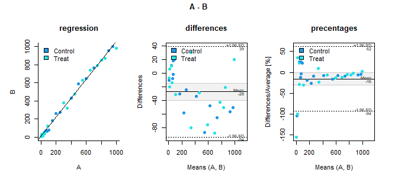
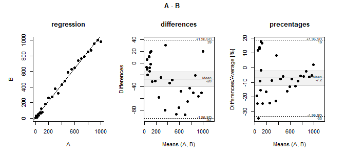
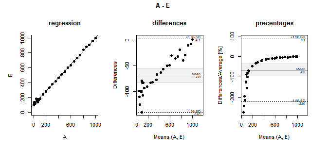

stp25metcomp
================
Wolfgang Peter
2023-04-11

Die generische Funktion MetComp() kann sowohl Kappa als auch Tukey-means
berechnen. Kappa kann aber auch über die xtab() berechnet werden. Wobei
hier nur 2x2-Tabellen untersucht werden können, hingegen sind bei
Kappa() auch mehrere ordinale Kategorien erlaubt.

Ähnliche Methode ist ICC die aber diese zählt eher zur
Reliabilitätsanalyse.

Funktionen: MetComp, MetComp_BAP, und Tbll_kappa, Tbll_icc

## Methodenvergleich

Oft interessiert die Zuverlässigkeit und Reproduzierbarkeit einer
Diagnose. Die Beurteilung kann dabei durch einen Bewerter
(Messverfahren) in wiederholter Form erfolgen und wird dann als
Intra-Rater bezeichnet oder die Beurteilung eines Merkmals erfolgt durch
mehrere Bewerter (Messverfahren). und hier spricht man von Inter-Rater.
Die Methode der Beurteilung der Übereinstimmung hängt von den jeweiligen
Verteilungseigenschaften ab.

Bei Nominalen wird abgezählt und die Rate der Übereinstimmung bewertet
(Cohen-Koeffizient) Bei Ordinalen-Daten werden die gewichteten
Übereinstimmungen ausgezählt (gewichteter Cohen-Koeffizient). Bei
metrischen(stetigen) Daten werden die Differenzen beurteilt
(Bland-Altman-Methode oder auch Tukey Mean Difference).

Bland-Altman-Methode Bias (d) systematische Abweichung Messfehler (s)
Standardabweichung der Differenz Limits of agreement (LOA) Intervall von
95 (entspricht d+-1.96 -\> es wird eine Normalverteilung unterstellt).

### Kappa Beispiel Botulinum

Beispiel Botulinum A

``` r
kable( MetComp(~A+B, Botulinum)$stat )
```

    ## Warning: Unknown or uninitialised column: `stat`.

``` r
 xt <-xtabs(~A+B, Botulinum)
 kable(Klassifikation(xt)$statistic[c(1,3,4), ])
```

| Statistic              | estimate |
|:-----------------------|:---------|
| Accuracy               | 0.80     |
| No Information Rate    | 0.52     |
| P-Value \[Acc \> NIR\] | p\<.001  |

### ICC

     Less than 0.50: Poor reliability
     Between 0.5 and 0.75: Moderate reliability
     Between 0.75 and 0.9: Good reliability
     Greater than 0.9: Excellent reliability

Suppose four different judges were asked to rate the quality of 10
different college entrance exams. The results are shown below: The
intraclass correlation coefficient (ICC) turns out to be 0.782.

Based on the rules of thumb for interpreting ICC, we would conclude that
an ICC of 0.782 indicates that the exams can be rated with “good”
reliability by different raters.

``` r
data <- data.frame(
  A = c(1, 1, 3, 6, 6, 7, 8, 9, 8, 7),
  B = c(2, 3, 8, 4, 5, 5, 7, 9, 8, 8),
  C = c(0, 4, 1, 5, 5, 6, 6, 9, 8, 8),
  D = c(1, 2, 3, 3, 6, 4, 6, 8, 8, 9)
)


Tbll_icc(data)
```

    ## boundary (singular) fit: see help('isSingular')

    ## # A tibble: 1 × 8
    ##   type  ICC   `lower bound` `upper bound` F       df1   df2 p    
    ## * <chr> <chr> <chr>         <chr>         <chr> <dbl> <dbl> <chr>
    ## 1 ICC2k 0.93  0.83          0.98          15.4      9    27 <.001

``` r
DF <- stp25tools::get_data("
nr   ratings obs    rate
1        9   obj1  rater1
2        6   obj2  rater1
3        8   obj3  rater1
4        7   obj4  rater1
5       10   obj5  rater1
6        6   obj6  rater1
7        2   obj1  rater2
8        1   obj2  rater2
9        4   obj3  rater2
10       1   obj4  rater2
11       5   obj5  rater2
12       2   obj6  rater2
13       5   obj1  rater3
14       3   obj2  rater3
15       6   obj3  rater3
16       2   obj4  rater3
17       6   obj5  rater3
18       4   obj6  rater3
19       8   obj1  rater4
20       2   obj2  rater4
21       8   obj3  rater4
22       6   obj4  rater4
23       9   obj5  rater4
24       7   obj6  rater4")
```

``` r
head(DF)
```

    ## # A tibble: 6 × 4
    ##      nr ratings obs   rate  
    ##   <int>   <int> <fct> <fct> 
    ## 1     1       9 obj1  rater1
    ## 2     2       6 obj2  rater1
    ## 3     3       8 obj3  rater1
    ## 4     4       7 obj4  rater1
    ## 5     5      10 obj5  rater1
    ## 6     6       6 obj6  rater1

``` r
Tbll_icc(DF,
     value = "ratings",
     obs = "obs",
     rater = "rate")
```

    ## # A tibble: 1 × 8
    ##   type  ICC   `lower bound` `upper bound` F       df1   df2 p    
    ## * <chr> <chr> <chr>         <chr>         <chr> <dbl> <dbl> <chr>
    ## 1 ICC2k 0.62  0.07          0.93          11.0      5    15 <.001

``` r
Giavarina <- transform(Giavarina, C = round( A + rnorm(30,0,20)),
                D = round( A + rnorm(30,0,10) + A/10 ),
                E = round( A + rnorm(30,5,10) + (100-A/10) ))


#ICC2(~A+E, Giavarina, caption="ICC (Korrelationen)")
```

### Altman and Bland \[@Giavarina2015\]

``` r
 kable ( MetComp(~A+B, Giavarina)$stat )
```

| Parameter              | Unit   | CI                  | SE    | Percent |
|:-----------------------|:-------|:--------------------|:------|:--------|
| df (n-1)               | 29     | NA                  |       |         |
| difference mean (d)    | -27.50 | \[-40.17, -14.83\]  | 6.20  | \<0.1%  |
| standard deviation (s) | 33.94  | NA                  |       | 39.8%   |
| critical.diff (1.96s)  | 66.52  | NA                  |       | 78.0%   |
| d-1.96s                | -94.02 | \[-115.97, -72.07\] | 10.73 | \<0.1%  |
| d+1.96s                | 39.02  | \[17.07, 60.97\]    | 10.73 | 117.8%  |

``` r
rslt <- DF %>% MetComp(A,B)
head(rslt$data)
```

    ##    A  B means diffs diffs.percent
    ## 1  1  8   4.5    -7    -155.55556
    ## 2  5 16  10.5   -11    -104.76190
    ## 3 10 30  20.0   -20    -100.00000
    ## 4 20 14  17.0     6      35.29412
    ## 5 50 39  44.5    11      24.71910
    ## 6 40 54  47.0   -14     -29.78723

``` r
rslt <- DF %>% MetComp(A,B,  by=~Therapie)
head(rslt$data)
```

    ##    A  B means diffs diffs.percent Therapie
    ## 1  1  8   4.5    -7    -155.55556    Treat
    ## 2  5 16  10.5   -11    -104.76190  Control
    ## 3 10 30  20.0   -20    -100.00000    Treat
    ## 4 20 14  17.0     6      35.29412    Treat
    ## 5 50 39  44.5    11      24.71910  Control
    ## 6 40 54  47.0   -14     -29.78723    Treat

``` r
plot(rslt)
```

<!-- -->

``` r
# A - Goldstandart

x <- MetComp_BAP(~A+B+E, Giavarina)
```

    ## Warning: Warning in bland.altman.stats:Mehr als 2 Methoden.

``` r
# x %>% Output("BA-Analyse der Messwertreihe")
plot(x)
```



``` r
x <- MetComp_BAP(~A+E+B, Giavarina)
```

    ## Warning: Warning in bland.altman.stats:Mehr als 2 Methoden.

``` r
# x %>% Output("BA-Analyse der Messwertreihe")
plot(x)
```



#### Verschiedene Situationen

``` r
x<- MetComp_BAP(~A+C, DF)
plot(x)
```


``` r
x<- MetComp_BAP(~A+B, DF)
plot(x)
```


``` r
x<- MetComp_BAP(~A+D, DF)
plot(x)
```


``` r
x<- MetComp_BAP(~A+E, DF)
plot(x)
```


